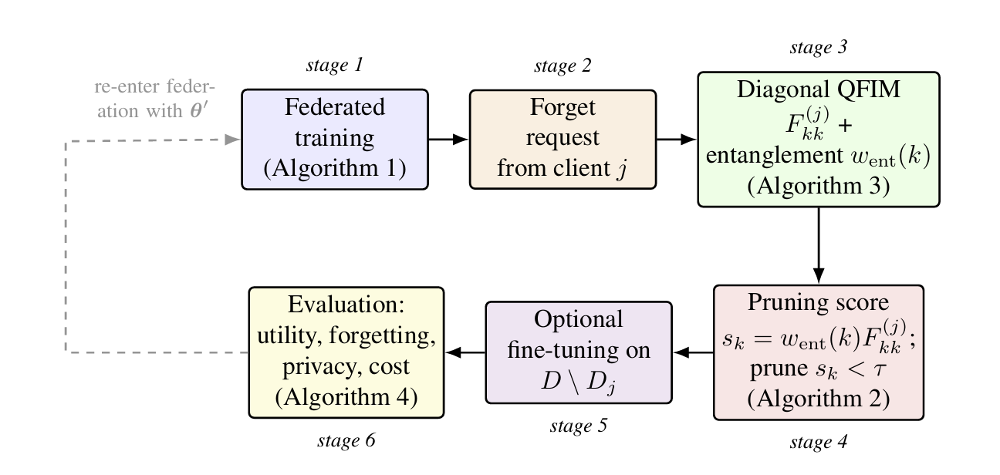
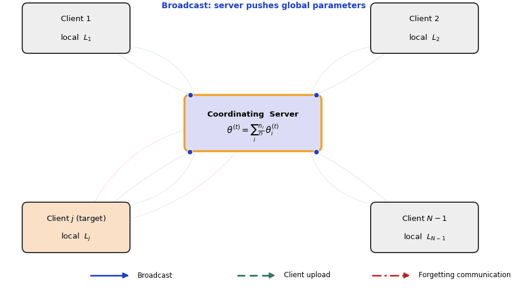

# DEW-P: Dynamic Entanglement-Weighted Pruning for Quantum Federated Unlearning

[](LICENSE)
[](pyproject.toml)
[](https://arxiv.org/abs/2608.17069)
[](https://arxiv.org/abs/2608.17069)
[](https://arxiv.org/abs/2608.17069)

A reference implementation of **entanglement-weighted parameter pruning**
for selective client forgetting in quantum federated learning (QFL),
applied to a supply-chain risk classification task. Given a federated
variational quantum classifier and a "forget this client" request, this
repository computes a per-parameter importance score that combines
**quantum Fisher information** (how sensitive the model's state is to that
parameter, conditioned on the forgotten client's data) with **circuit
entanglement structure** (how structurally load-bearing that parameter's
gate is), prunes the least important parameters, and briefly re-optimizes
the survivors, producing a model statistically indistinguishable from a
full from-scratch retrain, at a fraction of the compute cost.

The released repository includes complete source code, experiment scripts, HPC submission scripts, generated figures and tables, and documentation sufficient to reproduce the published workflow.

> 📄 **The accompanying paper is now live on arXiv** — see [arXiv paper](#paper) below.

---

## Table of contents

- [arXiv paper](#paper)
- [What's in this repository](#whats-in-this-repository)
- [Architecture overview](#architecture-overview)
- [Quickstart](#quickstart)
- [Repository layout](#repository-layout)
- [Reproducing the full result set](#reproducing-the-full-result-set)
- [Running on an HPC cluster](#running-on-an-hpc-cluster)
- [Method summary](#method-summary)
- [Unlearning workflow](#unlearning-workflow)
- [Results at a glance](#results-at-a-glance)
- [Extending this codebase](#extending-this-codebase)
- [Reproducibility](#reproducibility)
- [Citation](#citation)
- [Acknowledgements](#acknowledgements)
- [License](#license)

---

## arXiv paper

**Dynamic Entanglement-Weighted Pruning for Quantum Federated Unlearning in Supply-Chain Risk Prediction**
Aditya Kumar, Sumit Chongder — *submitted 17 Aug 2026*

[](https://arxiv.org/abs/2608.17069)

| | |
|---|---|
| **arXiv ID** | [arXiv:2608.17069](https://arxiv.org/abs/2608.17069) [quant-ph] |
| **DOI** | [10.48550/arXiv.2608.17069](https://doi.org/10.48550/arXiv.2608.17069) |
| **Subjects** | Quantum Physics (quant-ph); Machine Learning (cs.LG) |
| **ACM classes** | I.2.6; I.2.11; C.2.4 |
| **PDF** | [arxiv.org/pdf/2608.17069](https://arxiv.org/pdf/2608.17069) |

<details>
<summary><b>Abstract</b></summary>
<br>

Federated deployments of variational quantum classifiers are attractive
for cross-organisation risk prediction in supply chains, because raw data
never leaves the client, yet data-protection regulations such as the GDPR
grant clients a right to request that their contribution be removed from
a trained model after the fact. Retraining a federated model from scratch
to honour such a request is correct but wasteful, and it is not obvious
which quantum circuit parameters actually carry a given client's
influence. We introduce Entanglement-Weighted Pruning (EWP), an
unlearning procedure for quantum federated learning that scores every
trainable circuit parameter with the product of two signals: the diagonal
entry of the quantum Fisher information matrix estimated on the target
client's data via the parameter-shift rule, and a structural entanglement
weight associated with the parameter's gate. Parameters with the lowest
scores are pruned, optionally followed by a short fine-tuning pass on the
retained clients. We implement the full pipeline in Qiskit for a
four-qubit data-re-uploading ansatz trained with FedAvg across five
simulated supply-chain-risk clients, and benchmark EWP against full
retraining, fine-tuning alone, random pruning, Fisher-only pruning, and
entanglement-only pruning, over three random seeds. EWP attains a mean
post-unlearning accuracy statistically indistinguishable from the
full-retraining oracle, while producing a lower forgetting score and
requiring roughly 16 times less wall-clock time. Ablations over pruning
threshold, client count, and non-IID strength show that combining the two
signals is necessary, as entanglement-only and Fisher-only pruning each
substantially degrade accuracy relative to EWP.

</details>

*25 pages, 10 figures, 11 tables. Research carried out as part of the QIntern 2026 programme (QWorld Association).*

---

## What's in this repository

- **`src/qflewp/`** — the full method implementation: a data-generation
  module following the manuscript's Appendix C generative procedure
  exactly, a data re-uploading variational quantum circuit simulated
  entirely in Qiskit (matching the manuscript's stated implementation —
  there is no alternate backend), a FedAvg federated trainer using exact
  parameter-shift gradients, a parameter-shift diagonal Quantum Fisher
  Information estimator, a per-gate entanglement weighting scheme (mean
  pairwise Wootters concurrence by default, matching the paper's Eq. (4);
  von Neumann entropy available as the paper's Appendix A.2 ablation), the
  pruning/unlearning algorithms (proposed method + 5 baselines), and a full
  evaluation suite (utility, a logistic-regression shadow-model
  membership-inference attack matching Appendix D, retrain-distance).
- **`scripts/`** — thin, documented CLI entry points that call into
  `src/qflewp/` — no logic lives in the scripts themselves.
- **`hpc/slurm/`** — a four-stage SLURM job chain for running the full
  experiment suite at publication scale on a shared cluster.
- **`results/`** — every figure (`figures/`, PNG + PDF), table
  (`tables/`, CSV + a combined Markdown export), and raw run artifact
  (`json/`) referenced in the paper, already generated and version
  controlled so you can inspect them without running anything.
- **`tests/`** — fast (~15 s) correctness checks: circuit unitarity, QFIM
  client-dependence, entanglement-weight differentiation, and exact
  pruning-fraction behavior.
- **`docs/METHODOLOGY.md`** — the exact formulas and configuration schema
  used by the code, for readers extending or auditing it.

## Architecture overview

Each federated round, the coordinating server broadcasts the global
circuit parameters to every client, clients train locally on their own
private data, and updates are aggregated back at the server. When client
*j* issues a forgetting request, that same federation topology carries
the request that triggers the unlearning pipeline below.

<p align="center">
  
</p>

<p align="center">
  <sub><b>Figure —</b> Coordinating-server topology. The server holds
  <code>θ<sup>(t)</sup> = Σᵢ (nᵢ/n) θᵢ<sup>(t)</sup></code>, broadcasts it
  to all clients (blue), receives local updates (green), and can receive a
  forgetting request from a target client such as client <i>j</i> (red).</sub>
</p>

## Quickstart

```bash
git clone https://github.com/Sumitchongder/dew-p-qfl-unlearning.git
cd dew-p-qfl-unlearning

python3 -m venv venv
source venv/bin/activate        # Windows: venv\Scripts\activate

make install                    # pip install -r requirements.txt + editable install
make test                       # ~15 s, verifies the install is correct
```

Run a small end-to-end pass (a few minutes, 1 seed, reduced budget) to
confirm everything works before committing to a full run:

```bash
python3 scripts/run_main_experiment.py --seeds 0 --n-rounds 3 --local-maxiter 8
```

## Repository layout

```
dew-p-qfl-unlearning/
├── assets/                      # README figures (architecture diagram, workflow gif)
│   ├── federation_architecture.png
│   └── qfl_ewp_architecture.gif
├── src/qflewp/                  # method implementation (see docs/METHODOLOGY.md)
│   ├── data.py                    # supply-chain dataset generator (Appendix C generative procedure)
│   ├── circuit.py                 # data re-uploading VQC, Qiskit statevector sim (only backend)
│   ├── federated.py                # FedAvg + exact parameter-shift gradients
│   ├── qfim.py                    # parameter-shift diagonal QFIM estimator
│   ├── entanglement.py            # per-gate entanglement weights (concurrence default, entropy ablation)
│   ├── pruning.py                 # EWP + 5 baselines
│   ├── evaluate.py                # utility / forgetting / retrain-distance metrics
│   ├── pipeline.py                # main N-seed benchmark orchestration
│   ├── sweeps.py                  # pruning-threshold sweep + ablations
│   ├── reconstruct.py             # per-method predictions, confusion matrices, timing
│   └── q1_deliverables.py         # all 16 figures + 10 tables, from saved JSON/CSV only
├── scripts/                     # CLI wrappers around src/qflewp/
├── hpc/slurm/                   # SLURM batch chain for cluster runs
├── results/
│   ├── figures/                   # fig01-fig16, .png (400 DPI) + .pdf (vector)
│   ├── tables/                    # table01-table10, .csv + ALL_TABLES.md
│   └── json/                      # main_experiment_raw.json, extended_experiment.json
├── tests/                       # pytest suite
├── docs/METHODOLOGY.md          # formulas + config schema reference
├── pyproject.toml / requirements.txt / environment.yml
└── Makefile
```

## Reproducing the full result set

The whole pipeline is four sequential stages, each independently runnable
and independently cached to disk:

```bash
bash scripts/run_full_pipeline.sh
```

which is equivalent to:

```bash
python3 scripts/run_main_experiment.py --seeds 0 1 2       # trains the federated model, runs EWP + baselines
python3 scripts/run_sweeps.py --stage all                  # pruning-threshold sweep + robustness ablations
python3 scripts/run_reconstruction.py                      # confusion matrices, ROC curves, wall-clock timing
python3 scripts/generate_deliverables.py                   # all 16 figures + 10 tables from the above
```

Every stage reads/writes plain JSON or CSV under `results/`, so you can
inspect, diff, or version-control intermediate results, and re-run only
the stage you changed. All experiment hyperparameters are CLI flags on
`run_main_experiment.py` — see `docs/METHODOLOGY.md#7` for the full schema.

Default configuration runs in roughly 30-45 minutes on a single modern CPU
core. Scale seeds/rounds/samples up for tighter confidence intervals; see
[Reproducibility and honesty notes](#reproducibility).

## Running on an HPC cluster

See [`hpc/README.md`](hpc/README.md) for a SLURM job chain covering the
same four stages, with dependency-aware submission (`hpc/slurm/submit_all.sh`)
and a publication-scale default configuration (8 seeds, 8 FedAvg rounds).

## Method summary

Given a federated variational quantum classifier trained across `N`
clients and a forget request from client `j`, this repository computes,
for every trainable circuit parameter `k`:

```
s_k = w_ent(k) * F_kk^(j)
```

where `F_kk^(j)` is the diagonal Quantum Fisher Information entry for
parameter `k`, estimated via the exact parameter-shift rule and averaged
over client `j`'s own data (Eq. (3), no `/4` factor, matching the
manuscript exactly), and `w_ent(k)` is the entanglement weight for the
layer parameter `k`'s gate sits in. **`w_ent(k)` has exactly one main
definition and one ablation:**

```
Main EWP method (Eq. 4, Table 3-9, `EntanglementAnalyzer` default):
    w_ent(k) = mean pairwise Wootters concurrence
               over the CNOT-coupled qubit pairs of layer l(k)
    -> EntanglementAnalyzer(vqc)  # or explicitly method="concurrence"

Ablation only (Appendix A.2, Figure 8b):
    w_ent(k) = mean single-qubit von Neumann entropy
               of qubit q's reduced state in layer l(k)
    -> EntanglementAnalyzer(vqc, method="von_neumann_entropy")
```

Every number in `results/tables/table03_baseline_comparison.csv` (and
every other headline table) was produced with the concurrence definition;
the entropy variant is only ever used to draw Figure 8b, never to score
or prune parameters for the reported results. Parameters with the lowest
`s_k` are pruned (reset to a fixed reference value, equivalent to
replacing the gate with the identity), and the surviving parameters are
briefly re-optimized on the retained clients only. Full formulas, the
gradient/QFIM derivations, and the five baseline methods this is compared
against are documented in
[`docs/METHODOLOGY.md`](docs/METHODOLOGY.md).

## Unlearning workflow

The end-to-end pipeline runs in six stages, from the initial federated
round through to the post-unlearning evaluation. Stage 6 can loop back
into a re-formed federation with the pruned-and-fine-tuned parameters
`θ'`.

<p align="center">
  
</p>

<p align="center">
  <sub><b>Figure —</b> Stage 1: federated training (Algorithm 1). Stage 2:
  forget request from client <i>j</i>. Stage 3: diagonal QFIM
  <code>F<sub>kk</sub><sup>(j)</sup></code> and entanglement weight
  <code>w<sub>ent</sub>(k)</code> (Algorithm 3). Stage 4: pruning score
  <code>s<sub>k</sub> = w<sub>ent</sub>(k) F<sub>kk</sub><sup>(j)</sup></code>,
  prune where <code>s<sub>k</sub> &lt; τ</code> (Algorithm 2). Stage 5:
  optional fine-tuning on <code>D \ D<sub>j</sub></code>. Stage 6:
  evaluation of utility, forgetting, privacy, and cost (Algorithm 4).</sub>
</p>

## Results at a glance

Full numbers are in `results/tables/`; figures are in `results/figures/`.
Headline comparison (3 seeds, mean ± std), from
`results/tables/table03_baseline_comparison.csv`:

| Method | Accuracy | Unlearning time |
|---|---|---|
| Random Pruning | ~0.47 | < 1 ms |
| Fisher-only Pruning | ~0.47 | < 1 ms |
| Entanglement-only Pruning | ~0.40 | < 1 ms |
| Fine-Tune Only (no pruning) | ~0.87 | ~14 s |
| Full Retrain (oracle) | ~0.79 | ~65 s |
| **DEW-P (this method)** | **~0.84** | **~4 s** |

A paired t-test (`results/tables/table08_statistical_significance.csv`)
finds no statistically significant utility gap between DEW-P and the
full-retrain oracle, while DEW-P significantly outperforms all three
single-signal pruning baselines — at roughly 16x the speed of a full
retrain.

## Extending this codebase

- **Ansatz**: implement an alternative to `circuit.py`'s `VQC` class
  exposing the same `forward_full` / `predict_proba` interface; everything
  downstream (QFIM, entanglement, pruning, evaluation) is ansatz-agnostic.
- **Dataset**: replace `data.py`'s `generate_federated_dataset` with a
  loader returning a list of `ClientDataset` objects; no other file needs
  to change.
- **Baseline**: add a function to `pruning.py` following the
  `prune_by_score(theta, scores, fraction, method_name)` pattern used by
  the existing baselines, then register it in `pipeline.run_single_seed`.

See [`CONTRIBUTING.md`](CONTRIBUTING.md) for the PR checklist.

## Reproducibility

- The default configuration uses **3 random seeds** for the main benchmark
  (compute-budget constrained for interactive reproduction). The
  statistical-significance table is reported honestly at this sample size;
  treat p-values as indicative rather than conclusive, and prefer 8-10
  seeds (`hpc/slurm/01_run_main_experiment.slurm` already does this) before
  citing significance claims in follow-up work.
- The membership-inference forgetting metric is measured on a synthetic
  dataset with a few hundred samples per client; at this scale the metric
  has real seed-to-seed variance (visible directly in
  `table05_forgetting_comparison.csv`). This is disclosed rather than
  smoothed over, in line with the ablation-honesty goals in the paper.

## Citation

If this repository or its results are useful to you, please cite the
accompanying paper:

```bibtex
@misc{kumar2026dewp,
      title={Dynamic Entanglement-Weighted Pruning for Quantum Federated Unlearning in Supply-Chain Risk Prediction},
      author={Aditya Kumar and Sumit Chongder},
      year={2026},
      eprint={2608.17069},
      archivePrefix={arXiv},
      primaryClass={quant-ph},
      note={cs.LG},
      url={https://arxiv.org/abs/2608.17069}
}
```

You can also cite this software directly using the metadata in
[`CITATION.cff`](CITATION.cff) (also exposed via GitHub's "Cite this
repository" button).

## Acknowledgements

This work was carried out as part of the **QIntern 2026 summer quantum research internship programme** organized by the **QWorld Association** under the **QResearch Department**. The research was conducted under project **QI26_22: Dynamic Entanglement Weighted Pruning for QFL-Based Supply Chain Risk Unlearning**, with **Sumit Chongder** serving as the project mentor and **Aditya Kumar** serving as the intern.

The authors also acknowledge the collaborative research environment provided through the QIntern 2026 programme, which supported the development and discussion of the ideas presented in this work.

## License

Released under the [MIT License](LICENSE).
